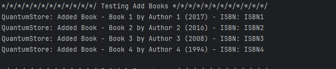
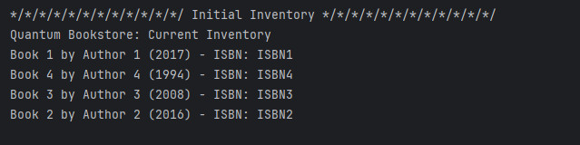
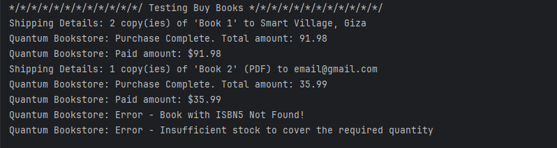
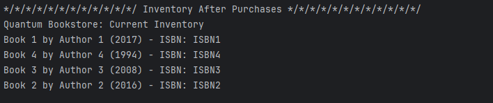
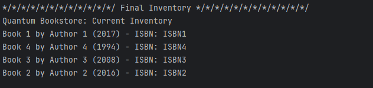
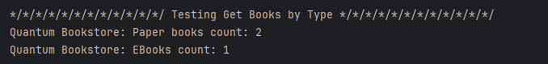

# Fawry-Quantum-Bookstore
An OO Bookstore Developed for the Fawry Rise Journey Full Stack Development Internship Challenge.

# Classes Used

## `abstract class Book`
The base class for all book types in the system.

### Attributes
- **`isbn`** - International Standard Book Number, a unique string identifier for each book
- **`title`** - The title of the book
- **`author`** - The author's name
- **`year`** - Publication year of the book
- **`price`** - Price of the book in dollars

### `ISBN` attribute
The ISBN serves as a unique identifier for each book in the inventory. It acts as the primary key for book lookup, retrieval, and purchase operations in the HashMap-based inventory system.

### Abstract Methods
- `getType()` - Returns the book type (PAPER, EBOOK, SHOWCASE)
- `isPurchasable()` - Determines if the book can be sold
- `canFulfillOrder(int quantity)` - Checks if the requested quantity is available
- `processPurchase(int quantity, String email, String address)` - Handles the purchase process

## `class PaperBook extends Book`
Represents physical books that have stock and require shipping.

### Additional Attributes
- **`stock`** - Number of copies available in inventory

## `class EBook extends Book`
Represents digital books that can be delivered via email.

### Additional Attributes
- **`filetype`** - The format of the digital book (PDF, EPUB, MOBI, etc.)

## `class ShowcaseBook extends Book`
Represents demonstration books that are not for sale.

## `class QuantumBookstore`
The main bookstore management system that handles all operations.

### Core Methods
- `addBook(Book book)` - Adds a book to the inventory
- `removeOutdatedBooks(int yearsThreshold)` - Removes books older than specified years
- `buyBook(String isbn, int quantity, String email, String address)` - Processes book purchases
- `displayInventory()` - Shows current inventory status

## Service Classes

### `class ShippingService`
Handles the shipping of physical books to customer addresses.

### `class MailService`
Manages the email delivery of digital books to customers.

## `enum BookType`
Defines the three types of books: PAPER, EBOOK, SHOWCASE

# Testing & Console Outputs
You can find the whole testing code in the `QuantumBookstore` class with the `Main` method.

## Output 1 - Adding Four Books

## Output 2 - Printing the Inventory

## Output 3 - Testing Buying Books

## Output 4 - Inventory After Purchases

## Output 5 - Testing Removing outdated books with `15` years threshold

## Output 6 - Final Inventory

## Output 7 - Testing getting books by type

